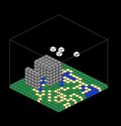

# isometric-js

Simple Isometric drawing library for HTML Canvas, ported from the
[`pebble-isometric`](https://github.com/C-D-Lewis/pebble-isometric) library.


## Functions

* `init` - Initialise with a background color and projection offset.
* `renderScene` - Provide a function that renders a scene.
* `pixel` - Draw a projected pixel.
* `rect` - Draw a projected rectangle outline.
* `box` - Draw a projected box outline.
* `filledRect` - Like `rect`, but filled in.
* `filledBox` - Like `box`, but filled in.
* `imageDataUrl` - Draw a flat filled rect using image as source data.

## Example

> See `examples` for more complex examples.

```js
Isometric.init('black', { x: 40, y: 100 });

Isometric.renderScene((width, height) => {
  const rect = { x: 0, y: 0, z: 0, width: 50, height: 50 };
  Isometric.filledRect(rect, 'red');

  const box = { x: 0, y: 0, z: 0, width: 30, height: 30 };
  const boxHeight = 100;
  Isometric.filledBox(box, boxHeight, 'blue');
});
```

The `block-world` example is a port of
[`pebble-hacks/block-world`](https://github.com/pebble-hacks/block-world).


